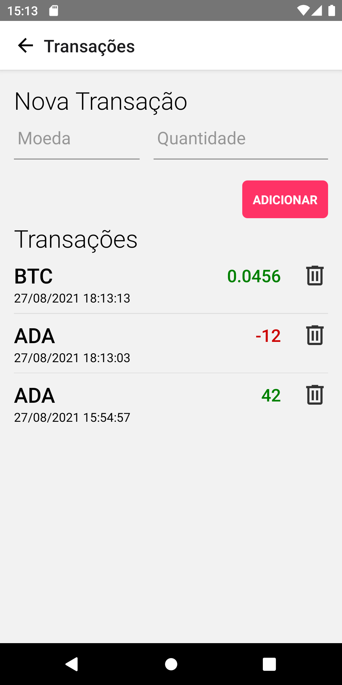

# Entrevista Técnica - Dev Full Stack - Yappi

Olá, esta é a entrevista técnica do processo seletivo da Yappi. Obrigado pelo interesse em trabalhar conosco!

Nesta parte do processo você deverá realizar algumas tarefas em um simples sistema de exemplo, que envolve as principais tecnologias que utilizamos por aqui.

Você deve ter acesso a dois repositórios, um com o código do backend e outro com o do frontend em React Native.

Em cada um deles você encontrará este arquivo README.md (que é igual em ambos os repos) e um arquivo INSTRUCTIONS.md, que possui instruções específicas para configurar o ambiente e executar cada parte do sistema.

### Encontrou algum problema?

O app não compila, os testes não rodam, a API não responde ou qualquer coisa do gênero...
Tente resolver sozinho(a) primeiro, mas não hesite em perguntar se o problema começar a dar muita dor de cabeça. Estamos disponíveis para ajudar, inclusive no final de semana!

Você pode entrar em contato através dos nossos emails ou WhatsApp:

Felippe Gallo: felippe@yappi.com.br / (11) 98955-1945

Rodrigo Mayer: rodrigo@yappi.com.br / (11) 95788-8969

### Nesta entrevista técnica, queremos saber se você pode:

- desenvolver funcionalidades com NodeJS
- desenvolver funcionalidades com React Native
- integrar o app em React Native com uma API feita em NodeJS
- escrever testes para o backend e para o frontend em React Native
- entender o código escrito por outras pessoas
- refatorar código
- encontrar bugs e corrigí-los
- escrever código de qualidade: simples, performático e elegante. Que seja inteligível pelos outros membros da equipe e resolva o problema.

### Observações importantes

Não é necessário realizar nada relacionado ao iOS. Você pode utilizar somente o Android para este teste.

Além disso, você pode notar que a aplicação que usamos aqui possui alguns problemas significativos...

- Não criptografamos a senha no banco
- Não utilizamos autenticação nos requests além do id do usuário
- Não há um processo de cadastro
- etc

Como o objetivo desta aplicação é de avaliação, não vamos implementar esses 'detalhes' tão importantes.

Não se preocupe, não fazemos essas cagadas em produção 😬

### O Sistema

O sistema de exemplo que vamos utilizar tem o propósito de organizar transações de criptomoedas.

O usuário, depois de logado, poderá cadastrar transações indicando qual criptomoeda comprou ou vendeu e também a quantidade adquirida.

Ele também poderá visualizar um resumo de sua posição atual, com o valor total de seu patrimônio e de cada uma de suas criptomoedas.

## Tarefas

1. O app possui as telas de Login e de Overview prontas. Você deverá implementar a funcionalidade de Transações conforme descrito a seguir:

   - Implemente a migration da tabela de transações. Você pode olhar as outras migrations como referência, localizadas em `src/database/migrations`. A [documentação do Knex](https://knexjs.org/#Migrations) também pode ajudar. Os comandos para lidar com migrations usando o knex estão na 'Cheatsheet', no arquivo `INSTRUCTIONS.md` do backend.

     Uma transação deve ter as seguintes informações:

     ```
     id: inteiro e incremental
     user_id: chave estrangeira para a tabela de usuários
     coin: nome da criptomoeda
     amount: quantidade da criptomoeda. Este valor deve possuir pelo menos 9 casas decimais e pode ser negativo para indicar vendas
     created_at: data e hora de criação
     updated_at: data e hora de atualização
     ```

     A API de Overview já está implementada e utiliza os títulos das colunas especificadas acima, atente-se a isso.

   - Implemente as seguintes rotas de transações no backend:

     - GET /transactions -> Deve retornar todas as transações do usuário
     - POST /transactions -> Deve cadastrar uma transação do usuário
     - DELETE /transactions/:transactionId - Deve apagar uma transação do usuário

     Para identificar o usuário, envie um header 'Authorization' com o id do usuário no banco. Você pode verificar como isto está implementado na rota de Overview.

   - Implemente a tela de Transações como na imagem abaixo e integre-a com API que você acabou de desenvolver.

     - Você pode criar o layout como desejar, mas pelo menos todos os campos mostrados abaixo devem estar presentes.
     - O campo 'Quantidade' deve aceitar valores negativos.
     - A lista de transações deve mostrar as mais recentes primeiro.
     - Após adicionar uma transação, os campos 'Moeda' e 'Quantidade' devem ser limpos, o teclado deve sumir e a lista deve ser atualizada.

     

   - Implemente os testes que achar necessário para a funcionalidade de transações, tanto no backend quanto no app. Você pode ver exemplos de testes do backend na pasta `__tests__` e do app na pasta `e2e`. Certifique-se que todos os testes passam antes de entregar sua solução (inclusive os testes que já estão escritos). A [documentação do Detox](https://github.com/wix/Detox) pode ajudar.

2. Os botões 'Entrar' da tela de Login e 'Transações' da tela de Overview podem ser implementados através de um componente reutilizável. Crie este componente e utilize-o nas duas telas.

## Entrega

A entrega deve ser feita através de dois Pull Requests, um em cada repositório, que vão conter as modificações realizadas por você.

Não faça os commits diretamente na branch main.

Após clonar os repositórios, crie uma branch develop a partir da main e envie os commits nesta branch develop. Seus Pull Requests devem ter como origem a branch develop e como destino a branch main.

O prazo de entrega está especificado no email de convocação para esta entrevista.

Boa sorte!
